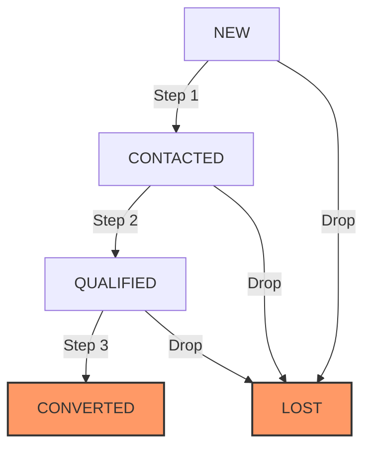

# Sales Lead CRM API

A high-performance, robust, and beautifully designed RESTful API for managing sales leads in a pipeline with predefined status transition rules (state-machine).

---

## 🚀 Tech Stack & Justification

### Python 3.11+

Python offers an exceptional ecosystem for web development with top-tier frameworks, robust testing suites, and a highly readable syntax that simplifies database modeling and validation rules.

### FastAPI

FastAPI is a modern, high-performance web framework. It leverages native Python type hints to automate request/response serialization, provides automated interactive API documentation (via Swagger UI and ReDoc), and boasts performance on par with NodeJS and Go.

### SQLite (via SQLAlchemy 2.0 ORM)

SQLite is a zero-configuration, serverless, file-based SQL database, making it ideal for running locally, testing, and keeping operations lightweight. By pairing it with SQLAlchemy 2.0 (the industry standard Python ORM), we ensure a clean separation between raw queries and business logic. Transitioning to a production-grade database like PostgreSQL requires changing only a single database connection string.

---

## Getting Started

You can run this application either using **Docker (Recommended)** or **locally with a Python virtual environment**.

### Option A: Using Docker & Docker Compose (Recommended)

Make sure you have Docker and Docker Compose installed.

1. **Start the API Server**:
   ```bash
   docker-compose up --build
   ```
   This command automatically:
   - Builds the optimized multi-stage container.
   - Run the database seeder (`seed.py`) to insert sample leads if the database is empty.
   - Starts the FastAPI application with live-reload enabled.
2. **Access the API**:
   - The API will be running at [http://localhost:8000](http://localhost:8000).
   - The interactive API documentation (Swagger) is available at [http://localhost:8000/docs](http://localhost:8000/docs).

3. **Stop the Application**:
   ```bash
   docker-compose down
   ```

### Option B: Local Setup (without Docker)

Ensure Python 3.11+ is installed.

1. **Create and Activate Virtual Environment**:

   ```bash
   python3 -m venv .venv
   source .venv/bin/activate  # On Windows, use `.venv\Scripts\activate`
   ```

2. **Install Dependencies**:

   ```bash
   pip install -r requirements.txt
   ```

3. **Seed the Database**:

   ```bash
   python seed.py
   ```

   This initializes `leads.db` (SQLite) and inserts 5 high-quality, realistic sample leads representing different pipeline stages.

4. **Start the Server**:
   ```bash
   uvicorn app.main:app --reload
   ```
   The API will be available at [http://127.0.0.1:8000](http://127.0.0.1:8000).

---

## 📖 API Documentation

The complete, interactive OpenAPI specification is hosted at `/docs`. Below is a summary of the available endpoints:

### Lead Data Model

| Field        | Type        | Description                                                                                                        |
| ------------ | ----------- | ------------------------------------------------------------------------------------------------------------------ |
| `id`         | `string`    | Auto-generated 8-character unique hex string primary key (e.g. `a1b2c3d4`).                                        |
| `name`       | `string`    | **Required.** Full name of the lead.                                                                               |
| `email`      | `string`    | **Required.** Must be a valid email format.                                                                        |
| `phone`      | `string`    | _Optional._ Contact phone number.                                                                                  |
| `status`     | `enum`      | **Auto-generated.** One of: `NEW`, `CONTACTED`, `QUALIFIED`, `CONVERTED`, `LOST`. (Defaults to `NEW` on creation). |
| `source`     | `string`    | _Optional._ Where the lead was sourced from (e.g., `website`, `referral`).                                         |
| `created_at` | `timestamp` | Auto-generated UTC timestamp of creation.                                                                          |
| `updated_at` | `timestamp` | Auto-generated UTC timestamp of last update.                                                                       |

---

### Endpoints

#### 1. Create a Lead

- **Method & Path**: `POST /leads`
- **Request Body**:
  ```json
  {
    "name": "Aman Gupta",
    "email": "aman@example.com",
    "phone": "+91-9876543210",
    "source": "website"
  }
  ```
- **Response (201 Created)**:
  ```json
  {
    "id": "a1b2c3d4",
    "name": "Aman Gupta",
    "email": "aman@example.com",
    "phone": "+91-9876543210",
    "status": "NEW",
    "source": "website",
    "created_at": "2026-05-28T02:00:00Z",
    "updated_at": "2026-05-28T02:00:00Z"
  }
  ```

#### 2. Get All Leads (with optional status filtering)

- **Method & Path**: `GET /leads`
- **Query Parameter**: `status` (Optional. Choices: `NEW`, `CONTACTED`, `QUALIFIED`, `CONVERTED`, `LOST`)
- **Example Request**: `GET /leads?status=NEW`
- **Response (200 OK)**:
  ```json
  [
    {
      "id": "a1b2c3d4",
      "name": "Aman Gupta",
      "email": "aman@example.com",
      "phone": "+91-9876543210",
      "status": "NEW",
      "source": "website",
      "created_at": "2026-05-28T02:00:00Z",
      "updated_at": "2026-05-28T02:00:00Z"
    }
  ]
  ```

#### 3. Get Lead by ID

- **Method & Path**: `GET /leads/:id`
- **Response (200 OK)**: Returns the lead object.
- **Response (404 Not Found)**: `{"detail": "Lead with ID a1b2c3d4 not found"}`

#### 4. Update Lead (Standard CRUD)

- **Method & Path**: `PUT /leads/:id`
- **Description**: Updates lead fields (`name`, `email`, `phone`, `source`). Status updates are ignored/rejected here to enforce state-machine logic.
- **Request Body**:
  ```json
  {
    "name": "Aman G. Gupta",
    "email": "aman.g@example.com",
    "phone": "+91-9876543211",
    "source": "referral"
  }
  ```
- **Response (200 OK)**: Returns updated lead.

#### 5. Change Lead Status (State Machine)

- **Method & Path**: `PATCH /leads/:id/status`
- **Description**: Transitions lead status between valid pipeline stages.
- **Request Body**:
  ```json
  {
    "status": "CONTACTED"
  }
  ```
- **Response (200 OK)**: Returns updated lead.
- **Response (400 Bad Request)** (Invalid Transition):
  ```json
  {
    "error": "Invalid status transition from NEW to CONVERTED"
  }
  ```

#### 6. Delete Lead

- **Method & Path**: `DELETE /leads/:id`
- **Response (200 OK)**:
  ```json
  {
    "message": "Lead with ID a1b2c3d4 deleted successfully"
  }
  ```

---

## ⚙️ Lead Status Workflow

We enforce a strict state machine to prevent pipeline integrity degradation:



### Transition Rules:

1. **Starting State**: All leads are automatically created with status `NEW`.
2. **Forward Movement**: Leads must move sequentially forward: `NEW` ➔ `CONTACTED` ➔ `QUALIFIED` ➔ `CONVERTED`. Skipping steps (e.g. `NEW` ➔ `QUALIFIED`) is forbidden.
3. **Drop to LOST**: Leads can drop to `LOST` from any active status (`NEW`, `CONTACTED`, `QUALIFIED`).
4. **Terminal States**: `CONVERTED` and `LOST` are terminal. No transitions out of these states are allowed.

---

## 🧪 Testing

We use `pytest` and `httpx` to verify all endpoints and state transitions with an **in-memory SQLite database** for clean isolation.

To run the tests locally:

```bash
pytest -v
```

---

## 🧠 Design Decisions & Scalability Trade-offs

### 1. Separation of Concerns & State Validation

We segregated our endpoints into a generic standard `PUT /leads/:id` and a dedicated `PATCH /leads/:id/status`.

- **Why**: Allowing status updates inside `PUT` weakens validation and increases security risks (e.g. users bypassing the pipeline state machine). Standardizing state modification to a single `PATCH` endpoint keeps business rules tightly encapsulated.

### 2. ID Generation Strategy

We utilize the first 8 characters of an auto-generated UUIDv4 (`uuid.uuid4().hex[:8]`).

- **Why**: Sequential integer IDs (`1`, `2`, `3`) leak business metrics (e.g., total leads created) and make the system vulnerable to brute-force scraping. Using short hex IDs provides non-guessable, URL-friendly IDs that perfectly fit standard UX patterns.

### 3. Handling Concurrent Status Transitions (At Scale)

When multiple sales agents operate in a high-volume call center, two agents might try to update a lead's status concurrently (e.g., one transitions `CONTACTED` ➔ `QUALIFIED`, while another marks it `LOST` simultaneously).

To handle this at scale, we would implement:

1. **Optimistic Locking (Recommended for High Read, Low Write conflict)**:
   - Add a `version` (integer) or `updated_at` (timestamp) column to the Lead table.
   - When updating, SQLAlchemy checks if the version matches:
     ```sql
     UPDATE leads SET status = 'QUALIFIED', version = version + 1
     WHERE id = :id AND version = :current_version;
     ```
   - If the row count returned is `0`, a concurrent modification occurred, and we raise a retryable transaction conflict error (`HTTP 409 Conflict`).
2. **Pessimistic Locking (For High Conflict pipelines)**:
   - Perform a blocking lock when reading the lead for transition:
     ```python
     # SQLAlchemy syntax
     db_lead = db.query(Lead).filter(Lead.id == lead_id).with_for_update().first()
     ```
   - This translates to `SELECT ... FOR UPDATE` in PostgreSQL/MySQL, which blocks other threads/processes trying to acquire a lock on this lead until the active transaction completes (commits or rolls back). Since SQLite serializes writes naturally, standard ORM integrations in PostgreSQL or MySQL would adopt this effortlessly.
